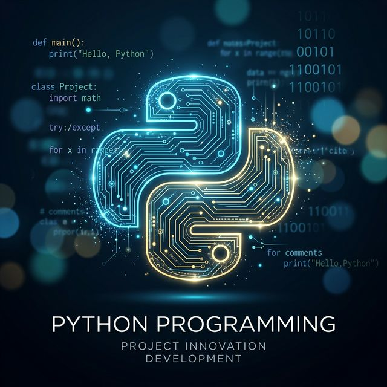

# 🐍 PythonTotal: Un Recorrido por el Dominio de Python 🚀

¡Bienvenido al repositorio de "apuntes interactivos"! Este espacio funciona como una bitácora detallada del progreso en el aprendizaje diario de Python, estructurada para facilitar la consulta y demostración de conceptos técnicos.

---

## 🎯 ¿De qué trata este proyecto?

Este repositorio constituye una **colección de notas de estudio convertidas en código funcional**. Se documenta el desarrollo continuo, abarcando desde conceptos fundamentales hasta la construcción de asistentes de voz y aplicaciones con integración de bases de datos. 

> [!TIP]
> **Enfoque del repositorio:** El aprendizaje se basa en la práctica directa y la resolución de problemas mediante la implementación de soluciones de software 🛠️.

---

## 📈 Progreso Diario

A continuación, se presenta un desglose de los módulos y proyectos desarrollados:

| Período | Tema / Proyecto | Descripción |
| :--- | :--- | :--- |
| **Día 1-3** | Fundamentos & Lógica | Implementación de variables, operadores y un analizador de texto. |
| **Día 4-5** | Juegos & Control | Desarrollo de "Adivina el número" y el clásico "Ahorcado". |
| **Día 6-7** | IO & POO | Gestión de archivos y arquitectura de Programación Orientada a Objetos 🏗️. |
| **Día 8-10** | Conceptos Avanzados| Uso de decoradores, generadores y protocolos de manejo de errores. |
| **Día 11** | 🕸️ Web Scraping | Extracción y procesamiento de datos web. |
| **Día 12** | 🖼️ Interfaces Gráficas | Creación de aplicaciones de escritorio mediante Tkinter. |
| **Día 13** | 🎙️ IA & Voz | Implementación de un asistente de voz funcional. |

---

## 🛠️ Tecnologías Exploradas

*   **Lenguaje:** Python 3.x 🐍
*   **GUI:** Tkinter 🖼️
*   **Web:** Scraping con BeautifulSoup/Requests 🕸️
*   **Datos:** SQLite & Gestión de sistemas de archivos 🗃️
*   **Extras:** Expresiones regulares, Estructuras de datos avanzadas y más.
